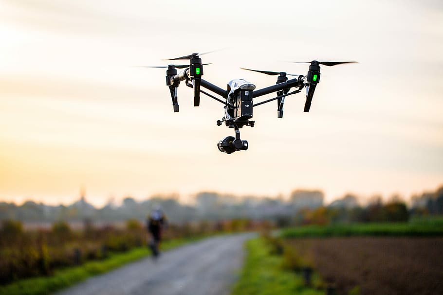
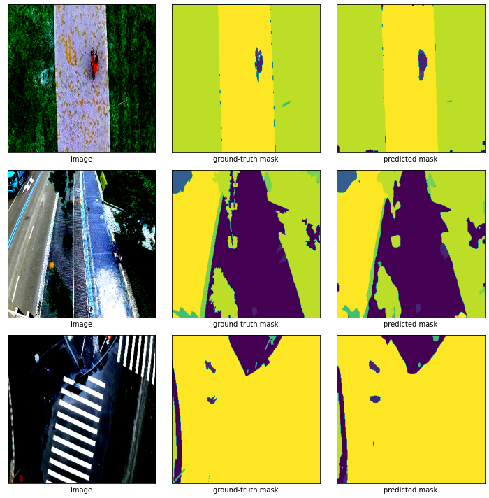

# Semantic_segmentation

Semantic segmentation model training using drones images.  In this case a Deeplab V3 algorithm was used.

The dataset can be foun in Kaggle repository by using the following commands:

> pip install kaggle

>kaggle competitions download -c opencv-pytorch-course-segmentation

the model identifies following classes:

  * background
  * person
  * bike
  * car
  * drone
  * boat
  * animal
  * obstacle
  * construction
  * vegetation
  * road
  * sky

Find below the inference done by the model trained.

If you have any inquiry do not hesitate in contact me:

robertoariasg88@gmail.com
